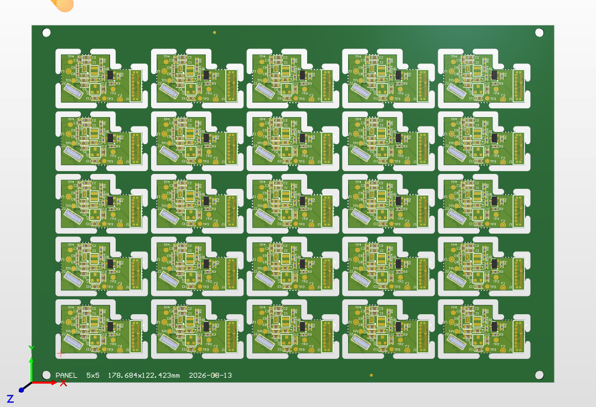
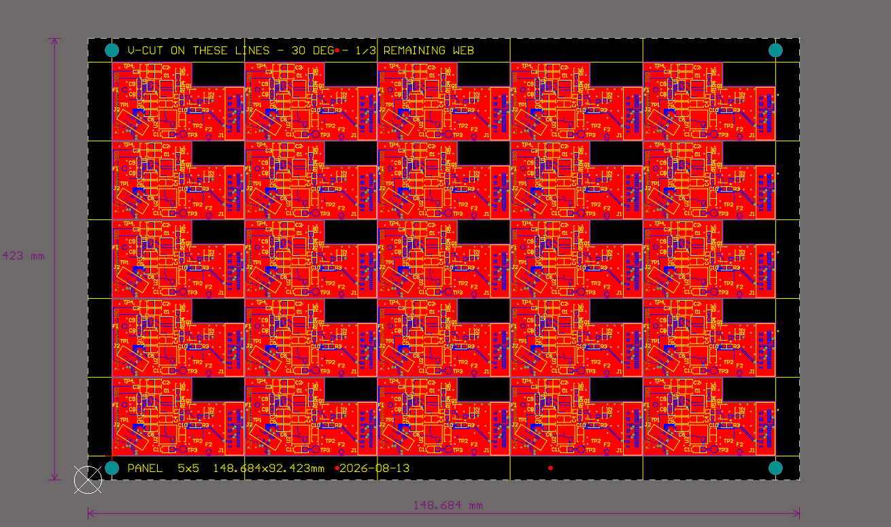

# Altium EZ Panelizer

An Altium Designer script that builds a depanelisable PCB panel from a single source
`.PcbDoc`, by **V-cut scoring** or **mouse bites**.

Developed against **Altium Designer 26.4.1** (Agile channel). DelphiScript, no SDK required.


## Examples

**Mouse bites** — 5 × 5 array, 178.684 × 122.423 mm. The router path follows each board's real
outline including the notch, spliced at tabs, with the perforations sitting on the board edge.



**V-cut** — 5 × 5 array, 148.684 × 92.423 mm, butted boards. Score lines run clear across the
panel, with rails, tooling holes, fiducials, dimensions and the fab note in the top rail.



Both were generated by this script from the same source board; the panels above are the
unedited output. Note the size difference for the same array — mouse-bite mode adds a routed
gap between every board and around the rails, while V-cut butts them together.

## What it produces

| Element | Detail |
|---|---|
| Board array | One `IPCB_EmbeddedBoard`, `Cols x Rows`, **live-linked** to the source PCB |
| Panel outline | Rectangular board shape sized to the array plus rails |
| Separation | V-cut score lines, or routed paths with mouse-bite tabs |
| Tooling holes | 4 NPTH in the rails, diameter and edge inset both adjustable |
| Fiducials | 3 asymmetric, 1 mm copper on the top layer |
| Title text | Panel name, array size, dimensions, date, plus a fab note for the method used |
| Dimensions | Overall width/height and array pitch, on their own mechanical layer |
| Sheet | Auto-fitted around the panel |

The panel's bottom-left corner sits on the absolute origin, so every fab coordinate is
measured from that corner.

## Install and run

1. Open `Altium_Ez_Panelizer.PrjScr` in Altium (File ▸ Open Project).
2. Run Script ▸ `RunEzPanelizer`.
3. Pick the source `.PcbDoc` → set options → **Build Panel**.

To have it always available, add the project under
**Preferences ▸ Scripting System ▸ Global Projects**.

If it never appears in the Run Script list, run it by process instead — this bypasses the
list entirely:

```
Process:     ScriptingSystem:RunScriptFile
Parameters:  FileName=<path>\Altium_Ez_Panelizer.pas|ProcName=Altium_Ez_Panelizer.pas>RunEzPanelizer
```

The `ProcName` format is `<file>><procedure>`; the `>` separator is required.

## Options

| Setting | Default | Notes |
|---|---|---|
| Columns / Rows | 2 x 3 | Array size |
| Gap X / Gap Y | 0 | 0 = butted. Mouse bites require a gap |
| Method | V-cut | V-cut, or mouse bites |
| Tab width | 5.0 mm | Mouse bites only |
| Tabs per edge | 2 | Per board edge, so 8 tabs hold each board |
| Hole dia | 0.5 mm | Perforation drill size |
| Holes per tab | 5 | Count in the drill row |
| Hole pitch | 1.0 mm | Spacing between holes; row is centred in the tab |
| Bit | 2.0 mm | Router bit diameter |
| Rail width | 5 mm | Left/right rails optional |
| Cut layer | Mechanical 1 | Renamed and typed automatically |
| Line width | 0.2 mm | Score line width |
| Tooling hole dia | 3.0 mm | |
| Edge inset | 5.0 mm | Panel side to hole centre |

## V-cut

A V-score is a straight blade cut that runs clear across the panel, so it must follow a
**board edge** — that is where the material has to separate.

With gap = 0 the boards are butted and each interior boundary needs one score. With a gap,
that boundary gets **two** scores, one per adjacent board edge, and the strip between them
drops out as waste. A single line down the middle of the gap would only score scrap.

Board-to-rail boundaries get one score. The panel's outer edge is never scored — it is milled.

## Mouse bites

The router traces **each board's actual outline** — not its bounding box — so notches, steps
and cutouts are followed properly. The path is spliced wherever a tab is left, and every tab is
perforated along the same line so it snaps off flush with the board edge.

The path is the cutter **centreline**, pushed half a bit outside the outline — the cut layer is
typed `Route Tool Path`, so a fab routs along the line rather than compensating from it. On the
outline itself the kerf would eat half a bit into every board. Corners are solved by
intersecting the displaced edges, so convex corners extend and concave ones tuck in properly.

Perforations stay on the **board edge**, not the offset path, so tabs break flush.

Two consequences worth knowing:

- **A gap of at least one bit diameter is required** on both axes, so the cutter fits. Below
  twice the bit diameter the two kerfs meet and no webbing is left between neighbouring boards
  — workable, but the tabs are then holding everything.
- **The panel grows by one gap on each railed side.** In V-cut mode the array butts straight
  against the rails; here the outer boards need clearance, and the material left between the
  cut and the rail stays behind as webbing.

Outline segments too short to hold a tab are routed solid, so the small edges of a notch do not
each collect their own tabs.

**Tab width and the drill row are independent.** Tab width is how much material is left
un-routed; count and pitch describe the drill pattern inside it. The row is centred in the tab
and may be narrower, which usually is what you want — a little solid material at each end.
`(count - 1) x pitch` has to fit within the tab width, and the script checks it.

Object counts add up quickly — 6 boards x 4 edges x 2 tabs is 72 rout segments and 288 holes.
Try 1 tab per edge first.

## Layers

| Layer | Name | Type |
|---|---|---|
| Cut layer (V-cut) | `V-Cut` | `mlVCut` |
| Cut layer (mouse bites) | `Routing` | `mlRouteToolPath` |
| Dimensions | `Panel Drawing` | `mlDimensions` |

Dimensions deliberately go on a **different** mechanical layer from the cut layer. The cut
layer is what the fab reads to position the blade or the router, and stray drawing lines there
would be read as extra cuts.

Perforation pads are designated `MB` and tooling holes `MH`, so each group is easy to select.

## Before you send it to a fab

- **Tooling holes may come out plated.** The `Plated := False` call is guarded and can be
  swallowed. Check the drill table.
- **Fiducial mask openings follow the board rule**, not a forced 2 mm. Add a Mask Expansion
  rule scoped to pads named `FID` if the opening is too tight.
- **Save the panel beside the source board** so the embedded array keeps a relative link.
- **Output Gerber/ODB++ from the panel.** The array is a link, so the raw `.PcbDoc` is not
  self-contained.

## Known limits

- Array pitch uses the source outline's bounding box. Mouse-bite rout paths follow the real
  outline, but arc segments are taken as the chord between their endpoints — exact for
  rectilinear outlines, slightly inside the true edge on a rounded corner.
- V-cut mode assumes a rectangular board, which is inherent to scoring: a straight blade cannot
  follow a notch. Use mouse bites for non-rectangular boards.
- Outlines longer than 512 vertices are truncated.
- The outward offset does not trim self-intersections, so a concave pocket narrower than the
  bit will not offset cleanly — such a pocket cannot be routed at that bit size anyway, but
  check it by eye rather than trusting the path.
- Dimensions are drawn from tracks and text, not `IPCB_Dimension` objects — a drawing aid, not
  live measurements. Move something and the numbers will not follow.
- Tabs are spaced evenly along each edge. Placing them away from connectors needs manual edits.
- Title text clears the left tooling hole only; a very long title could reach the right one.
- Vertical dimension captions sit horizontally beside the line.

## Developer notes

`NOTES.md` documents the Altium DelphiScript API findings behind this script — which
properties are writable, which are read-only traps, and how to verify one without breaking
the whole unit. Worth reading before extending it.
